# Anamnesis

> A stateful, spec-driven framework for AI-assisted software engineering.

This framework solves the core problems of AI-assisted coding: **Amnesia** (forgetting context), **Hallucination** (guessing), **Vibe Coding** (lack of specs), and **Monolithic Code** (bad architecture).

---

## 🚀 Quick Start for Users

### 1. Setup a New Project

To "hydrate" a new project with this framework:

1. **Copy the framework:** Copy the `coding/` folder to your project root
2. **Create root file:** Copy `coding/templates/AGENTS.template.md` to your project root as `AGENTS.md`
3. **Customize root file:** Edit `AGENTS.md` with your project details:
   - Project overview and tech stack
   - Common commands (build, test, lint)
   - Key constraints
4. **Create learnings file:** Move `coding/templates/PROJECT_LEARNINGS.template.md` to your project root as `PROJECT_LEARNINGS.md`
5. **Initialize context:** Create `.context/` directory for state management

### 2. CLI Tool Setup

The `AGENTS.md` root file is auto-loaded by AI CLI tools. Configure based on your tool:

**OpenCode**

Works natively with `AGENTS.md` - no configuration needed.

**Gemini CLI**

Choose one option:
- **Option A (Recommended):** Add to `~/.gemini/settings.json`:
  ```json
  {
    "context": {
      "fileName": ["AGENTS.md", "GEMINI.md"]
    }
  }
  ```
- **Option B:** Copy `coding/templates/GEMINI.template.md` to your project root as `GEMINI.md`

**Claude Code**

Copy `coding/templates/CLAUDE.template.md` to your project root as `CLAUDE.md`

### 3. The Workflow You Will See

Don't be alarmed if the AI doesn't start coding immediately. It is following a strict **Spec-Driven** protocol:

1. **Context Loading:** It reads `.context/active_state.md`.
2. **Spec Loop:** For complex tasks, it will draft/update `docs/specs/` (Product, Tech, Requirements, Tasks).
3. **Consensus Gate:** It will present a **Plan Summary** and **WAIT** for your approval.
4. **Stop-and-Wait Execution:** It implements one task from `docs/specs/tasks.md` at a time.
5. **Drift Detection:** It ensures code matches the Spec.
6. **Epilogue:** It updates Docs, Changelog, and Learnings before quitting.

---

## 🔄 Interaction Diagram

```mermaid
sequenceDiagram
    participant User
    participant AI as AI Architect
    participant State as .context/active_state.md
    participant Specs as docs/specs/

    User->>AI: Prompt ("Build Feature X")
    
    rect rgb(30, 30, 30)
    Note right of AI: Phase 0: Context
    AI->>State: Read State & Constraints
    end

    alt Simple Task (< 1 hr)
        AI->>User: Execute & Answer (Escape Hatch)
    else Complex Task
        rect rgb(20, 50, 80)
        Note right of AI: Phase 1: Blueprint
        AI->>Specs: Draft/Update Specs (Product, Tech, Req)
        AI->>Specs: Create tasks.md (Execution Plan)
        AI->>User: 🛑 Plan Summary & Request Approval
        end
        
        User->>AI: "Proceed" (Consensus Gate)

        loop Phase 2: Stop-and-Wait
            AI->>Specs: Read Next Task from tasks.md
            AI->>AI: Implement Atomic Unit
            AI->>AI: Verify (Tests)
            AI->>Specs: Mark [x] in tasks.md
            AI->>User: "Task Complete. Continue?"
            User->>AI: "Continue"
        end

        rect rgb(20, 80, 20)
        Note right of AI: Phase 4: Epilogue
        AI->>Specs: Drift Detection (Code vs Spec)
        AI->>State: Archive State & Update Learnings
        AI->>User: "Session Closed."
        end
    end
```



---

## 📚 Progressive Disclosure Architecture

The framework uses a **Progressive Disclosure** pattern to optimize AI context usage:

| Layer | File | When Loaded | Purpose |
|-------|------|-------------|---------|
| **Root** | `AGENTS.md` | Always (auto-loaded) | Essential context, golden rules, pointers |
| **Thinking** | `coding/THINKING_DIRECTIVES.md` | New ideas, features, refactors, complex bugs | First Principles & Design Thinking |
| **Execution** | `coding/EXECUTION_DIRECTIVES.md` | Implementation tasks | Build, test, deliver protocols |
| **Quality** | `coding/CODING_STANDARDS.md` | Code writing | Style and quality rules |
| **Wisdom** | `PROJECT_LEARNINGS.md` | Every session | Project-specific constraints |

**Why?** LLMs have limited instruction-following capacity (~150-200 instructions). The slim root file (~100 lines) provides essential context, and detailed protocols are read only when needed. The separation of Thinking and Execution allows different cognitive modes for different tasks.

---

## 🧠 The Core Components

### 1. `THINKING_DIRECTIVES.md` (The Mind)

This guides problem decomposition BEFORE implementation (v4.0):
- **First Principles:** Strip problems to fundamental truths before building solutions.
- **Design Thinking:** Understand users, define problems clearly, explore options.
- **Root Cause Analysis:** Structured debugging for complex bugs.
- **Consensus Gate:** Present thinking summary and WAIT for user validation.

### 2. `EXECUTION_DIRECTIVES.md` (The Hands)

This guides implementation AFTER thinking is complete (v4.0):
- **Spec-Driven Development (SDD):** No code without a persistent "Source of Truth".
- **State Management:** Uses `.context/active_state.md` to track progress across sessions.
- **OODA Loop:** Observe, Orient, Decide, Act for debugging.
- **OODA Stop-Gap:** After 3 failed iterations, assess confidence and potentially return to thinking.

### 3. `CODING_STANDARDS.md` (The Quality)

This defines the syntax rules:
- **EARS Syntax:** Requirements must use "When... Then..." syntax to reduce ambiguity.
- **Visual Architecture:** Complex flows require Mermaid.js diagrams.
- **Two-Tiered Testing:** Strictly separates Unit Tests (fast, mocked) from Contract Tests (boundaries).

### 4. `PROJECT_LEARNINGS.md` (The Wisdom)

This file gets smarter over time. It captures:
- **Invariants:** Rules that must never be broken.
- **Patterns:** Solutions that worked.
- **Anti-Patterns:** Approaches that failed.

### 5. `coding/templates/` (The Tools)

Standardized templates for Spec-Driven Development:

**Root File Templates:**
- `AGENTS.template.md` - Primary root file (auto-loaded by AI CLI tools)
- `CLAUDE.template.md` - Wrapper for Claude Code
- `GEMINI.template.md` - Wrapper for Gemini CLI

**Project Templates:**
- `PROJECT_LEARNINGS.template.md` - Cumulative project wisdom seed

**Spec Templates:**
- `spec_problem.md` - Problem definition (User, Pain, Constraints)
- `spec_options.md` - Solution alternatives considered
- `spec_product.md` - The "Why" (User Persona, Anti-Goals)
- `spec_tech.md` - The Constraints (Stack, Forbidden Libraries)
- `spec_requirements.md` - The "What" (EARS Syntax)
- `spec_design.md` - The Visuals (Mermaid Diagrams)
- `spec_tasks.md` - The Plan (Stop-and-Wait Checklist)

**State Templates:**
- `active_state.md` - Current session state
- `handover.md` - Session handover summary
- `changelog.md` - Version history format
- `decision_log.md` - Architectural decision records

---

## 📂 Directory Structure

The framework expects this structure in your project:

```text
# Project Root
AGENTS.md                    # Root file (auto-loaded by AI CLI tools)
CLAUDE.md                    # Optional: Claude Code wrapper
GEMINI.md                    # Optional: Gemini CLI wrapper (if not using settings.json)
PROJECT_LEARNINGS.md         # Cumulative project wisdom
DECISION_LOG.md              # Architectural decisions

.context/
├── active_state.md          # Current session state (hot)
├── handover.md              # Previous session summary (baton)
└── history/                 # Archived states (audit trail)

docs/
└── specs/                   # Source of Truth (SDD)
    ├── problem.md           # Problem definition
    ├── options.md           # Solution alternatives
    ├── product.md           # The "Why" & "Vibe"
    ├── tech.md              # The Constraints
    ├── requirements.md      # The "What" (EARS Syntax)
    ├── design.md            # The Visuals (Mermaid)
    └── tasks.md             # The Plan

coding/
├── THINKING_DIRECTIVES.md   # First Principles & Design (v4)
├── EXECUTION_DIRECTIVES.md  # Build & Deliver (v4)
├── CODING_STANDARDS.md      # Code quality rules (v4)
└── templates/               # All templates (15 files)
    ├── AGENTS.template.md
    ├── CLAUDE.template.md
    ├── GEMINI.template.md
    ├── PROJECT_LEARNINGS.template.md
    ├── active_state.md
    ├── handover.md
    ├── changelog.md
    ├── decision_log.md
    ├── spec_problem.md
    ├── spec_options.md
    ├── spec_product.md
    ├── spec_tech.md
    ├── spec_requirements.md
    ├── spec_design.md
    └── spec_tasks.md
```

---

## ⚡ Pro-Tips for the User

- **The "Escape Hatch":** If you just want to ask "How do I list files?", the AI knows to skip the heavy process. Just ask.
- **The "Consensus Gate":** The AI will **STOP** after planning. You must explicitly say "Proceed" or "Approved" to start coding.
- **The "Epilogue":** If the AI says "I'm done" but hasn't updated the docs, just type: **"Execute Epilogue."**
- **Debug Loop:** If the AI gets stuck, it will enter the **OODA Loop** (Observe, Orient, Decide, Act). It will ask you to run commands to gather evidence. **Run them.**
- **Root File Customization:** The `AGENTS.md` file should be customized for each project. Fill in your tech stack, common commands, and key constraints. The CLI configuration section at the bottom can be removed after initial setup.

---

## 🛑 The "Golden Rules" (For the AI)

1. **Update State:** If it's not in `.context/active_state.md`, it didn't happen.
2. **Follow the Spec:** Code must match `docs/specs/requirements.md`.
3. **Telegraphic Context:** Internal notes should be caveman-style ("Server crash. Retry fail.").
4. **Professional Docs:** Public docs must be Shakespearean.
